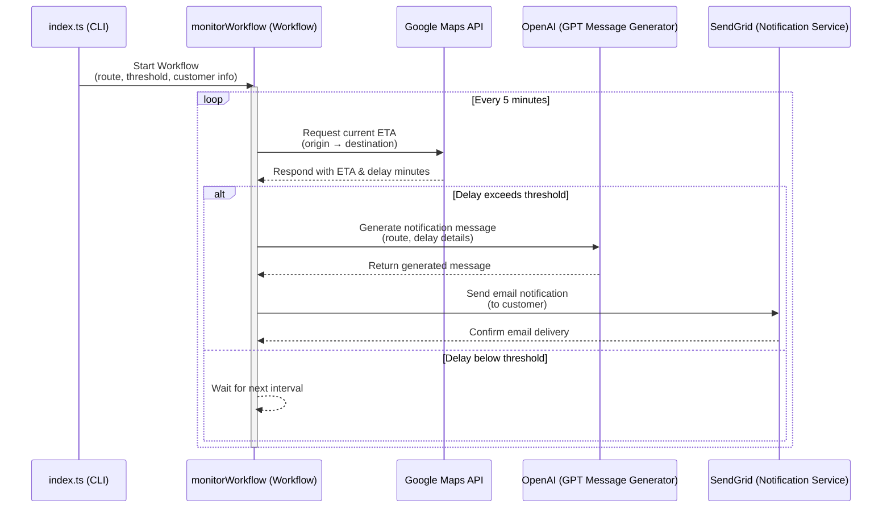
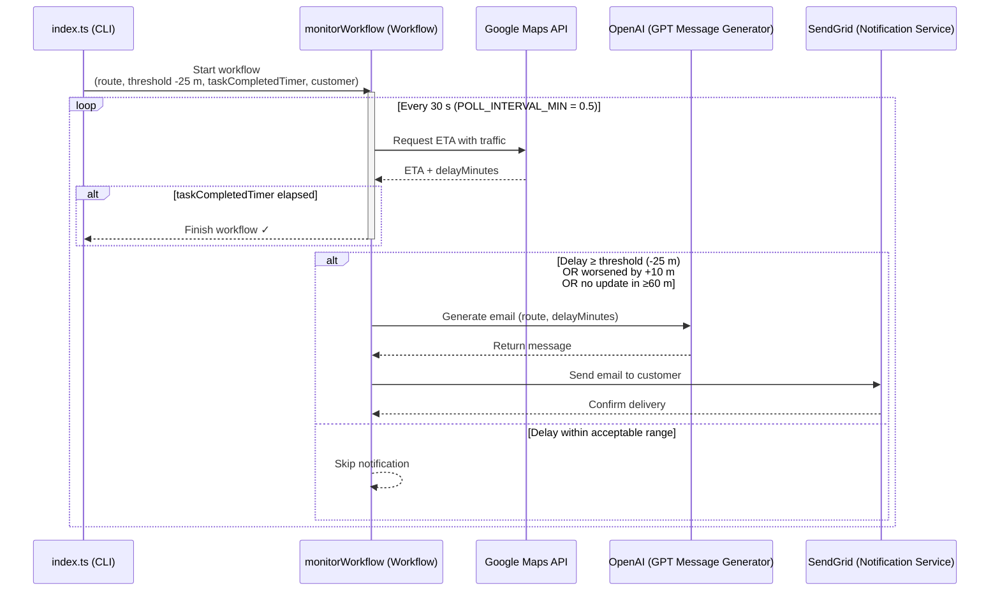

<!-- <div align="center"style="text-align: center;">


</div> -->

<div align="center" style="text-align: center;">
   

 
 
</div>

# Freight Delay Notification System 🚚

An end‑to‑end TypeScript / Temporal demo that monitors live road traffic for predefined freight routes and notifies customers by email when shipments are delayed.

Powered by:

* **Google Maps Directions API** – real‑time ETA and traffic data
* **OpenAI GPT‑4o-mini** – generates polite, context‑rich customer messages
* **SendGrid** – delivers the email
* **Temporal** – orchestrates long‑running workflows, polling, retries and timing

## Table of contents

1. [Architecture](#architecture)
2. [Repository layout](#repository-layout)
3. [Getting started](#getting-started)
4. [Configuration](#configuration)
5. [Scripts & tasks](#scripts)
6. [Testing](#testing)
7. [Troubleshooting](#troubleshooting)

## Architecture


```mermaid
sequenceDiagram
    participant CLI as index.ts (CLI)
    participant WF as monitorWorkflow (Workflow)
    participant Maps as Google Maps API
    participant OpenAI as OpenAI (GPT Message Generator)
    participant SendGrid as SendGrid (Notification Service)

    CLI->>WF: Start Workflow<br/>(route, threshold, customer info)
    activate WF
    loop Every 5 minutes
        WF->>Maps: Request current ETA<br/>(origin → destination)
        Maps-->>WF: Respond with ETA & delay minutes
        
        alt Delay exceeds threshold
            WF->>OpenAI: Generate notification message<br/>(route, delay details)
            OpenAI-->>WF: Return generated message
            
            WF->>SendGrid: Send email notification<br/>(to customer)
            SendGrid-->>WF: Confirm email delivery
        else Delay below threshold
            WF-->>WF: Wait for next interval
        end
    end
    deactivate WF

```

```mermaid
sequenceDiagram
    participant CLI as index.ts (CLI)
    participant WF  as monitorWorkflow (Workflow)
    participant Maps as Google Maps API
    participant OpenAI as OpenAI (GPT Message Generator)
    participant SendGrid as SendGrid (Notification Service)

    %%— Bootstrap —%%
    CLI->>WF: Start workflow <br/>(route, threshold -25 m, taskCompletedTimer, customer)
    activate WF

    %%— Main polling loop —%%
    loop Every 30 s (POLL_INTERVAL_MIN = 0.5)
        %% 1️⃣ Get live traffic
        WF->>Maps: Request ETA with traffic
        Maps-->>WF: ETA + delayMinutes

        %% 2️⃣ Simulate delivery completion
        alt taskCompletedTimer elapsed
            WF-->>CLI: Finish workflow ✓
            deactivate WF
        end

        %% 3️⃣ Otherwise, check delay status
        alt Delay ≥ threshold (-25 m)<br/>OR worsened by +10 m<br/>OR no update in ≥60 m
            WF->>OpenAI: Generate email (route, delayMinutes)
            OpenAI-->>WF: Return message

            WF->>SendGrid: Send email to customer
            SendGrid-->>WF: Confirm delivery
        else Delay within acceptable range
            WF-->>WF: Skip notification
        end
    end

```

Each job (route) runs as its own perpetual workflow instance and follows the loop above. Temporal makes the polling and retry logic fault‑tolerant and horizontally scalable.

## Repository layout

```text
├── launch.json              
├── package-lock.json         
├── package.json              
├── README.md                 # Project documentation
├── src
│   ├── config.ts             # Config for tuning thresholds, origins, etc.
│   ├── index.ts              # Entry point: schedules workflows
│   ├── worker.ts             # Worker registration and runner
│   ├── activities/           # OpenAI, SendGrid calls, Google Maps
│   │   ├── ai.ts
│   │   ├── notifications.ts
│   │   └── traffic.ts        
│   └── workflows/            # Temporal workflow logic
│       ├── delayNotifications.ts
│       ├── index.ts
│       └── monitorWorkflow.ts
├── tsconfig.json             # TypeScript configuration
└── your_temporal.db          # SQLite DB used by Temporal server
```

## Getting started

\### 1. Prerequisites

* Node.js >= 18
* A running Temporal server (e.g., `docker‑compose up` from the official samples)
* Alternatively, you can run brew install temporal and start the Temporal server locally (for testing and development purposes only).
* API keys: Google Maps, OpenAI, SendGrid

\### 2. Install

```bash
git clone <repo>
cd freight-delay-monitor
npm install
```

\### 3. Environment variables Create a `.env` file at the repo root:

```bash
OPENAI_API_KEY=<your key>
SENDGRID_API_KEY=<your key>
GOOGLE_MAPS_API_KEY=<your key>
```
\### 4. 👉 Install via Homebrew (Mac / Linux):

```bash
brew install temporal
temporal --version
temporal server start-dev
```
\### 5. You should see logs like:

```bash
Temporal server started.
Namespace default registered.
```

\### 6. Build & run

```bash
# compile TypeScript
npm run build

# start worker + schedule workflows
npm start
```

Logs will show one worker poller and one workflow scheduled per entry in `src/config.ts`.

## Configuration

## `src/config.ts`

The `config.ts` file is the **central place** to define all key parameters, routes, and customers for the freight monitoring system. You can customize it without touching any other part of the codebase.

---


* `TASK_QUEUE`: The Temporal **queue name** where workers listen for tasks. Default: `'FreightMonitorQueue'`.


### 🚦 Tuning knobs

| Constant            | Description                                                                                                                 | Default |
| ------------------- | --------------------------------------------------------------------------------------------------------------------------- | ------- |
| `TASK_QUEUE`  | The Temporal **queue name** where workers listen for tasks. |`'FreightMonitorQueue'`.  |
| `GLOBAL_THRESHOLD`  | The minimum delay (in minutes) before sending an alert. **⚠️ Important:** Remove the `-` sign to track real traffic delays. | `-25`   |
| `DELTA_JUMP_MIN`    | The extra delay (minutes) needed to consider the delay as “worsened” and send an updated notification.                      | `10`     |
| `MAX_QUIET_MIN`     | The maximum time (minutes) the workflow waits before sending a fresh update, even if the delay hasn't changed much.         | `60`     |
| `CLEAR_MARGIN_MIN`  | When delays drop below `(threshold - this margin)`, the delay is considered “cleared.”                                      | `3`     |
| `POLL_INTERVAL_MIN` | How often (in minutes) the system polls Google Maps for new traffic data.                                                   | `5`     |
| `ROLL_OVER_HOURS`   | Workflow rollover interval to keep Temporal histories small (hours).                                                        | `4`     |

---

### 🗺 Routes & Customers

Example predefined **origins**, **destinations**, and customers:

| Job ID | Origin Address                           | Destination | Customer Name | Customer Email                                                  |
| ------ | ---------------------------------------- | ----------- | ------------- | --------------------------------------------------------------- |
| 1      | Neuschwansteinstraße 20, 87645 Schwangau | Stuttgart   | Christian C   | [hire@christianc.dev](mailto:hire@christianc.dev) |
| 2      | Bielkenhagen 10, 18439 Stralsund         | Munich      | Manny M       | [hire@christianc.dev](mailto:hire@christianc.dev) |
| 3      | Unter den Linden 10, 10117 Berlin        | Berlin      | Leo M         | [hire@christianc.dev](mailto:hire@christianc.dev) |

To **add new routes, origins and custumers**, simply append to the `src/config.ts` array:

```ts

export const Origin_4 = 'New Origin 4';
export const Destination_4 = 'New Destination 4';
export const Customer_4 = { name: 'Jon Doe', email: 'JonDoe@example.com' };


 {
    job_id: 4,
    route: {
        origin: Origin_4,
        destination: Destination_4,
        },
    threshold: GLOBAL_THRESHOLD,
    customer: Customer_4,
    },
```


---

✅ **Pro Tip:**

* To **disable a job**, simply comment it out in `ROUTE_CONFIGS`.
* To **adjust sensitivity**, change `GLOBAL_THRESHOLD` and rerun your workflows.

This file is designed for **easy customization**—no code elsewhere needs changes when you modify routes, customers, or thresholds.

* **.env** for secret keys

## Scripts

`package.json` exposes handy aliases:

* `npm run worker` – start just the worker
* `npm run start` – worker + job scheduler
* `npm run test:traffic` / `test:ai` / `test:notif` – run individual module tests
* `npm run test:workflow` – run Temporal workflow tests (uses @temporalio/testing)

## Testing

Tests are written with Jest and nock for HTTP mocking. To execute all:

```bash
npm test
```

## Troubleshooting

* **No emails arriving?** Check SendGrid dashboard activity and verify `FROM_EMAIL` in `notifications.ts`.
* \`\` errors – ensure `.env` is loaded or environment is passed to your process manager.
* **Workflow "already started"** messages on restart are expected and benign – each job reuses its `workflowId`.

## License

MIT © 2025 Christian Cosio