<!-- <div align="center"style="text-align: center;">


</div> -->

<div align="center" style="text-align: center;">
   

 
 
</div>

# <div align="center" style="text-align: center;"> 🚚 <br> Freight Delay Notification System Exercise <br> Engineering Edition </div>

An end‑to‑end TypeScript / Temporal demo that monitors live road traffic for predefined freight routes and notifies customers by email when shipments are delayed.

🎯 Objective
Create an app (in TypeScript) to monitor traffic delays on a freight delivery route and notify a customer if a significant delay occurs.
The goal of this exercise is to assess your ability to work with APIs, handle data transformations, and build a multi-step workflow using Temporal (and their TypeScript SDK).

📘 Scenario
Imagine you’re tasked with setting up a notification system for delayed freight deliveries. You will use Temporal to create a workflow that:

Checks traffic conditions on a delivery route

Calculates potential delays

Uses an AI API to generate a customized message if a delay exceeds a specified threshold

Sends a notification to a customer about the delay

And finalizes workflow on delivery (Simulated - Bonus) 

App Config behaviour adjustmen panel ready (Bonus)

Powered by:

* **Google Maps Directions API** – real‑time ETA and traffic data
* **OpenAI GPT‑4o-mini** – generates polite, context‑rich customer messages
* **SendGrid** – delivers the email
* **Temporal** – orchestrates long‑running workflows, polling, retries and timing


## Table of contents

1. [Architecture](#architecture)
2. [Repository layout](#repository-layout)
3. [Getting started](#getting-started)
4. [Configuration](#configuration)
5. [Scripts & tasks](#scripts)
6. [Troubleshooting](#troubleshooting)

## Architecture

```mermaid
sequenceDiagram
    participant CLI as index.ts (CLI)
    participant WF  as monitorWorkflow (Workflow)
    participant Maps as Google Maps API
    participant OpenAI as OpenAI (GPT Message Generator)
    participant SendGrid as SendGrid (Notification Service)

    %%— Bootstrap —%%
    CLI->>WF: Start workflow <br/>(route, threshold GLOBAL_THRESHOLD=-25 m, taskCompletedTimer, customer)
    activate WF

    %%— Main polling loop —%%
    loop Every 30 s (POLL_INTERVAL_MIN = 0.5)
        %% 1️⃣ Get live traffic
        WF->>Maps: Request ETA with traffic
        Maps-->>WF: ETA + delayMinutes

        %% 2️⃣ Simulate delivery completion
        alt taskCompletedTimer elapsed
            WF-->>CLI: Finish workflow ✓
            deactivate WF
        end

        %% 3️⃣ Otherwise, check delay status
        alt Delay ≥ threshold (GLOBAL_THRESHOLD=-25 m)<br/>OR worsened by DELTA_JUMP_MIN= +10 m<br/>OR no update in MAX_QUIET_MIN=≥60 m
            WF->>OpenAI: Generate email (route, delayMinutes)
            OpenAI-->>WF: Return message

            WF->>SendGrid: Send email to customer
            SendGrid-->>WF: Confirm delivery
        else Delay within acceptable range
            WF-->>WF: Skip notification
        end
    end

```



Each job (route) runs as its own workflow instance until completion and follows the loop above. Temporal makes the polling and retry logic fault‑tolerant and horizontally scalable.

[⬆ Back to top](#table-of-contents)


## Repository layout

```text
├── launch.json              
├── package-lock.json         
├── package.json              
├── README.md                 # Project documentation
├── src
│   ├── config.ts             # Config for tuning thresholds, origins, etc.
│   ├── index.ts              # Entry point: schedules workflows
│   ├── worker.ts             # Worker registration and runner
│   ├── test/                 # Testing modules
│   ├── activities/           # OpenAI, SendGrid calls, Google Maps
│   │   ├── ai.ts
│   │   ├── notifications.ts
│   │   └── traffic.ts        
│   └── workflows/            # Temporal workflow logic
│       ├── delayNotifications.ts
│       ├── index.ts
│       └── monitorWorkflow.ts
├── tsconfig.json             # TypeScript configuration
└── your_temporal.db          # SQLite DB used by Temporal server
```

[⬆ Back to top](#table-of-contents)

## Getting started

\### 1. Prerequisites

* Node.js >= 18
* A running Temporal server (e.g., `docker‑compose up` from the official samples)
* Alternatively, you can run brew install temporal and start the Temporal server locally (for testing and development purposes only).
* API keys: Google Maps, OpenAI, SendGrid

\### 2. Install

```bash
git clone https://github.com/Christian8D/freight-delay-notifier-levityAI.git
cd freight-delay-notifier
npm install
```

\### 3. Environment variables Create a `.env` file at the repo root:

```bash
OPENAI_API_KEY=<your key>
SENDGRID_API_KEY=<your key>
GOOGLE_MAPS_API_KEY=<your key>
```
\### 4. 👉 Install via Homebrew (Mac / Linux):

```bash
brew install temporal
temporal --version
temporal server start-dev
```
\### 5. You should see logs like:

```bash
Temporal server started.
Namespace default registered.
```

\### 6. Build & run

```bash
# compile TypeScript
npm run build

# start worker + schedule workflows
npm start
```

Logs will show one worker poller and one workflow scheduled per entry in `src/config.ts`.

[⬆ Back to top](#table-of-contents)

## Configuration

## `src/config.ts`

The `config.ts` file is the **central place** to define all key parameters, routes, and customers for the freight monitoring system. You can customize it without touching any other part of the codebase.

---


* `TASK_QUEUE`: The Temporal **queue name** where workers listen for tasks. Default: `'FreightMonitorQueue'`.


### 🚦 Tuning knobs

| Constant            | Description                                                                                                                 | Default |
| ------------------- | --------------------------------------------------------------------------------------------------------------------------- | ------- |
| `TASK_QUEUE`  | The Temporal **queue name** where workers listen for tasks. |`'FreightMonitorQueue'`.  |
| `GLOBAL_THRESHOLD`  | The minimum delay (in minutes) before sending an alert. **⚠️ Important:** Remove the `-` sign to track real traffic delays. | `30`   |
| `DELTA_JUMP_MIN`    | The extra delay (minutes) needed to consider the delay as “worsened” and send an updated notification.                      | `15`     |
| `MAX_QUIET_MIN`     | The maximum time (minutes) the workflow waits before sending a fresh update, even if the delay hasn't changed much.         | `60`     |
| `CLEAR_MARGIN_MIN`  | When delays drop below `(threshold - this margin)`, the delay is considered “cleared.”                                      | `30`     |
| `POLL_INTERVAL_MIN` | How often (in minutes) the system polls Google Maps for new traffic data.                                                   | `.5` 30s    |

---

[⬆ Back to top](#table-of-contents)

### 🗺 Routes & Customers

Example predefined **origins**, **destinations**, and customers:

| Job ID | Origin Address                           | Destination | Customer Name | Customer Email                                                  |
| ------ | ---------------------------------------- | ----------- | ------------- | --------------------------------------------------------------- |
| 1      | Neuschwansteinstraße 20, 87645 Schwangau | Stuttgart   | Christian C   | [hire@christianc.dev](mailto:hire@christianc.dev) |
| 2      | Bielkenhagen 10, 18439 Stralsund         | Munich      | Manny M       | [hire@christianc.dev](mailto:hire@christianc.dev) |
| 3      | Unter den Linden 10, 10117 Berlin        | Berlin      | Leo M         | [hire@christianc.dev](mailto:hire@christianc.dev) |

To **add new routes, origins and custumers**, simply append to the `src/config.ts` array:

```ts

export const Origin_4 = 'New Origin 4';
export const Destination_4 = 'New Destination 4';
export const Customer_4 = { name: 'Jon Doe', email: 'JonDoe@example.com' };


 {
    job_id: 4,
    route: {
        origin: Origin_4,
        destination: Destination_4,
        },
    threshold: GLOBAL_THRESHOLD,
    customer: Customer_4,
    },
```


---

✅ **Pro Tip:**

* To **disable a job**, simply comment it out in `ROUTE_CONFIGS`.
* To **adjust sensitivity**, change `GLOBAL_THRESHOLD` and rerun your workflows.

This file is designed for **easy customization**—no code elsewhere needs changes when you modify routes, customers, or thresholds.

* **.env** for secret keys

[⬆ Back to top](#table-of-contents)

## Scripts

`package.json` exposes handy aliases:

* `npm run worker` – start just the worker
* `npm run start` – worker + job scheduler
* `npm run test:traffic` / `test:ai` / `test:notif` – run individual module tests
* `npm run test:workflow` – run Temporal workflow tests (uses @temporalio/testing)

[⬆ Back to top](#table-of-contents)

## Troubleshooting

* **No emails arriving?** Check SendGrid dashboard activity and verify `FROM_EMAIL` in `notifications.ts`.
* \`\` errors – ensure `.env` is loaded or environment is passed to your process manager.
* **Workflow "already started"** messages on restart are expected and benign – each job reuses its `workflowId`.

## License

MIT © 2025 Christian Cosio